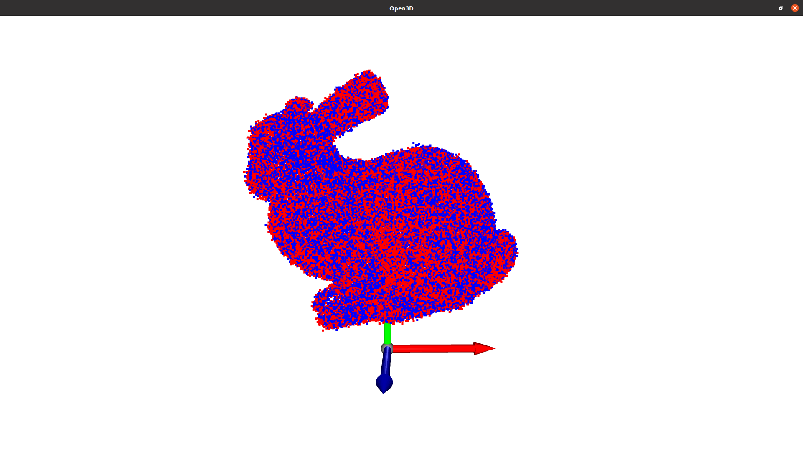

# Autonomous_Mobile_Robotics_SLAM

## Dependencies
* Python>=3.8
* Open3d

## Usage
1. Install the required libraries using pip

2. Run the python script with arguments in the folder

    ***Argument 1***: task: *task1*, *task2*

    ***Argument 2***: method: for task1, *none*, *downSampling*; for task2, *none*, *downSampling*, *globalReg*, *combined*


   ```terminal
   python ICP.py --task=task1 --method=downSampling
   ```

## Demonstration
 <-- Applying ICP with down-sampling and global registration for 60 iterations