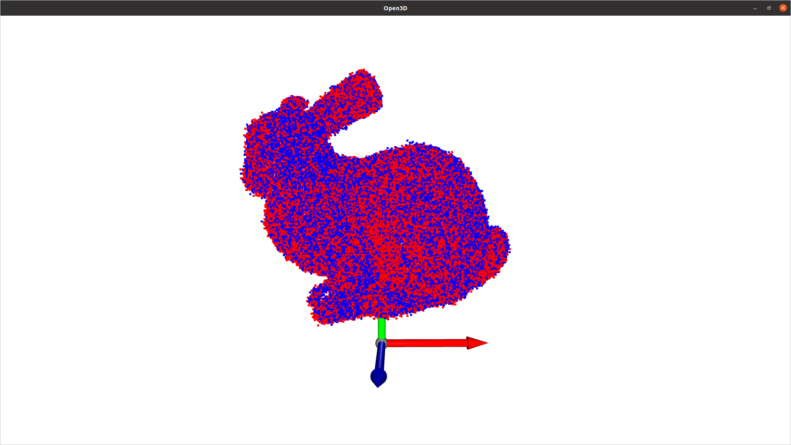
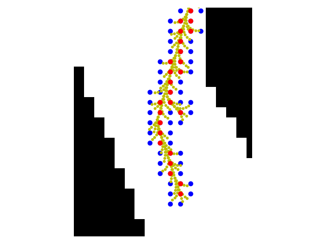
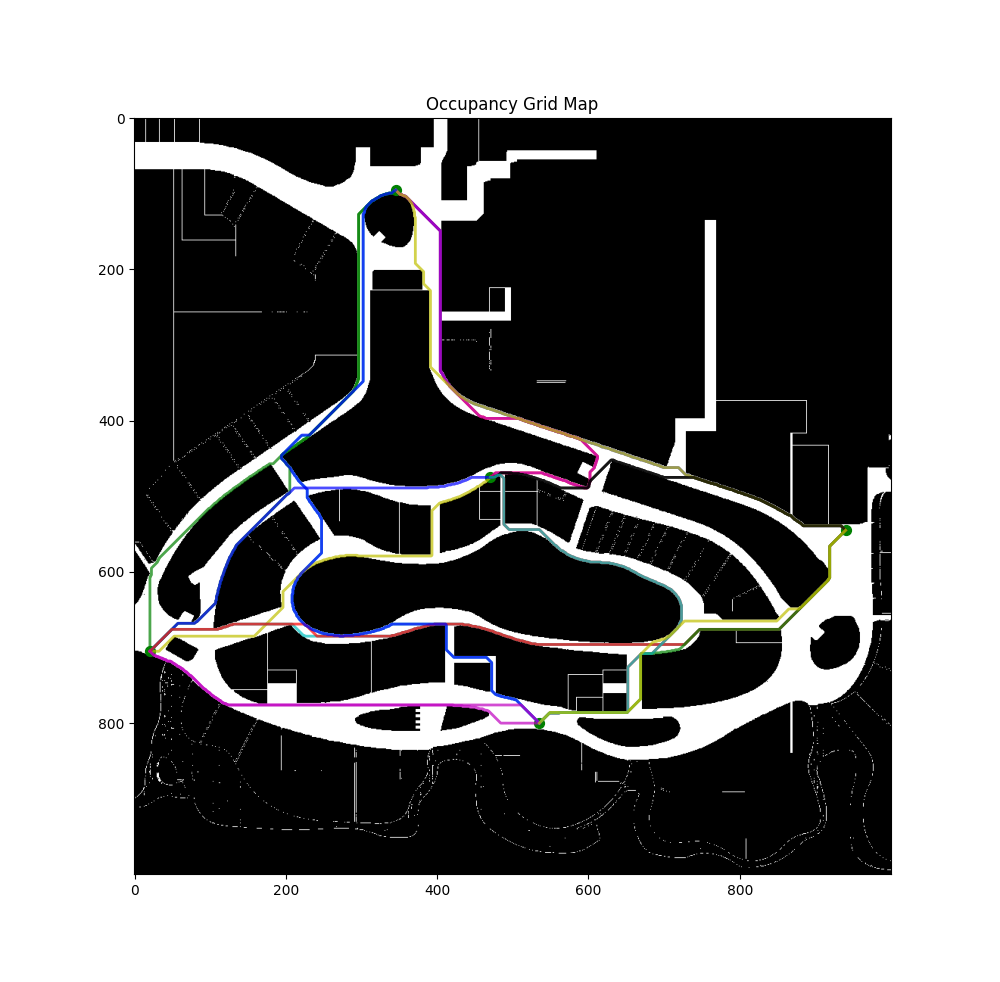
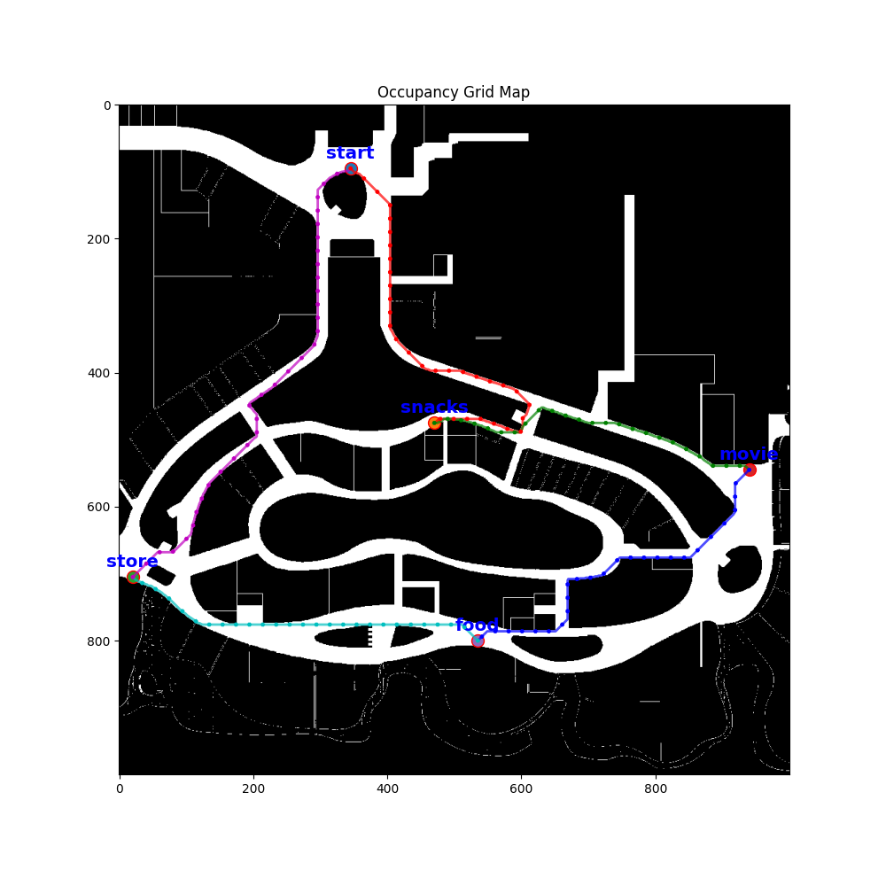

# Autonomous_Mobile_Robotics

## Dependencies
* Python>=3.6
* ROS Melodic/Noetic
* Open3d
* sklearn
* json

## Usage
1. Install the required libraries using pip, or 
* using conda:

   ```terminal
   conda env create -f environment.yml
   ```

2. Run the python or jupiter script in the folders

* Clustering
   ```bash
   cd Perception
   ```

   ```bash
   cd 1_lidar
   ```

   ```terminal
   python LiDAR_Clustering.py
   ```

* ICP
   ```terminal
   cd ICP
   ```

    ***Argument 1***: --task: *task1*, *task2*

    ***Argument 2***: --method: for task1, *none*, *downSampling*; for task2, *none*, *downSampling*, *globalReg*, *combined*


   ```terminal
   python ICP.py --task=task1 --method=downSampling
   ```

* Planning
   ```terminal
   python Planning/src/plan.py 
   ```

   *You can select different planners in plan.py*

## Demonstration

### LiDAR clustering

* DBSCAN


* Meanshift&nbsp;&nbsp;&nbsp;&nbsp;&nbsp;&nbsp;&nbsp;&nbsp;&nbsp;&nbsp;&nbsp;&nbsp;&nbsp;&nbsp;&nbsp;&nbsp;&nbsp;&nbsp;&nbsp;&nbsp;&nbsp;&nbsp;&nbsp;&nbsp;&nbsp;&nbsp;&nbsp;&nbsp;&nbsp;&nbsp;&nbsp;&nbsp;&nbsp;&nbsp;&nbsp;&nbsp;&nbsp;&nbsp;&nbsp;&nbsp;&nbsp;OPTICS&nbsp;&nbsp;&nbsp;&nbsp;&nbsp;&nbsp;&nbsp;&nbsp;&nbsp;&nbsp;&nbsp;&nbsp;&nbsp;&nbsp;&nbsp;&nbsp;&nbsp;&nbsp;&nbsp;&nbsp;&nbsp;&nbsp;&nbsp;&nbsp;&nbsp;&nbsp;&nbsp;&nbsp;&nbsp;&nbsp;&nbsp;&nbsp;&nbsp;&nbsp;&nbsp;&nbsp;K-means


* Agglomerative&nbsp;&nbsp;&nbsp;&nbsp;&nbsp;&nbsp;&nbsp;&nbsp;&nbsp;&nbsp;&nbsp;&nbsp;&nbsp;&nbsp;&nbsp;&nbsp;&nbsp;&nbsp;&nbsp;&nbsp;&nbsp;&nbsp;&nbsp;&nbsp;&nbsp;&nbsp;&nbsp;&nbsp;&nbsp;&nbsp;&nbsp;&nbsp;&nbsp;&nbsp;&nbsp;&nbsp;&nbsp;&nbsp;&nbsp;&nbsp;&nbsp;&nbsp;&nbsp;&nbsp;&nbsp;&nbsp;&nbsp;&nbsp;&nbsp;&nbsp;Birch


<br>

### Clustering ROS implementation


<br>

### ICP
 <-- Applying ICP with down-sampling and global registration for 60 iterations

### A* algorithm and its variations
 <-- Node expansion of hybrid-A*

 <-- Paths planned by bidirectional-A*
 <-- Optimal path for traveling seller problem solved by brute-force method
